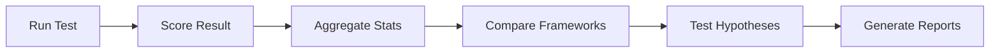

# Specification Alignment Benchmark

**Version 1.0.0** - Implementation Complete, Ready for Testing

A scientific benchmark for comparing AI coding assistant **frameworks** (not models) on specification alignment detection. By using the same model (Claude 3.5 Sonnet) across Cursor and Claude Code, we isolate framework-specific capabilities.

## 🎯 What This Does

This benchmark tests how well AI coding frameworks can find three types of specification misalignments:

1. **Type 1 - Missing**: Features in the spec but not in code
2. **Type 2 - Incorrect**: Features implemented differently than specified  
3. **Type 3 - Extraneous**: Features in code but not in the spec

By using the same AI model (Claude 3.5 Sonnet) across different frameworks, we isolate and measure framework-specific capabilities like search, context management, and code understanding.

## 🚀 Quick Start

### Prerequisites
```bash
# Install dependencies
pip install -r requirements.txt
```

### 1. Check Test Progress
```bash
# See overall progress across 240 planned tests
python scripts/test_runner.py progress

# See what tests to run next
python scripts/test_runner.py next cursor
```

### 2. Run a Test

**In your framework (Cursor or Claude Code):**
1. Load the todo app test repository
2. Switch to a test branch (e.g., `baseline_balanced`)
3. Copy a prompt from `benchmark/prompts/type1-missing.md`
4. Run it and save the JSON output

**Record and score the result:**
```bash
python scripts/test_runner.py record \
  cursor baseline_balanced type1 output.json --score
```

### 3. Analyze Results
```bash
# After multiple runs, aggregate statistics
python scripts/aggregate_results.py \
  --framework cursor --branch baseline_balanced

# Compare frameworks
python scripts/compare_frameworks.py \
  --branch baseline_balanced

# Generate visualizations
python scripts/visualize_results.py --all
```

## 🔬 Test Design

### 6 Test Branches (38 Total Misalignments)
| Branch | Type 1 | Type 2 | Type 3 | Purpose |
|--------|--------|--------|--------|---------|
| control_perfect | 0 | 0 | 0 | False positive baseline |
| baseline_balanced | 3 | 3 | 2 | Overall capability (H1) |
| type1_heavy | 6 | 1 | 1 | Type 1 specialization (H2a) |
| type2_heavy | 1 | 6 | 1 | Type 2 specialization (H2b) |
| subtle_only | 2 | 2 | 2 | Complexity handling (H3) |
| distributed | 3 | 3 | 2 | File distribution (H4) |

### 5 Hypotheses Being Tested
1. **H1**: Overall performance difference
2. **H2**: Type-specific specialization patterns
3. **H3**: Complexity degradation rates
4. **H4**: Context distribution effects
5. **H5**: False positive generation rates

## 📁 What's Implemented

```
spec-alignment-benchmark/
├── benchmark/                   # Core benchmark content
│   ├── branches/               # 6 test branches, 38 misalignments
│   │   ├── control_perfect/   # False positive baseline (0)
│   │   ├── baseline_balanced/ # Overall testing (8)
│   │   ├── type1_heavy/       # Type 1 focus (8)
│   │   ├── type2_heavy/       # Type 2 focus (8)
│   │   ├── subtle_only/       # Subtle issues (6)
│   │   └── distributed/       # Many files (8)
│   ├── prompts/               # 4 test prompts
│   └── hypotheses.md          # 5 scientific hypotheses
│
├── scripts/                    # Analysis pipeline
│   ├── test_runner.py         # Test execution manager
│   ├── score_result.py        # Individual scoring
│   ├── aggregate_results.py   # Statistical aggregation
│   ├── compare_frameworks.py  # Hypothesis testing
│   └── visualize_results.py   # Charts & reports
│
└── results/                    # Test outputs (generated)
    ├── raw/                   # Framework outputs
    ├── processed/             # Scored results
    └── analysis/              # Comparisons & charts
```

## 🔬 The Three Misalignment Types

### Type 1: Missing Implementation
**What**: Spec says "must have X", code doesn't have X  
**Example**: Spec requires JWT auth, code has no auth  
**Output**: List of missing section headers

### Type 2: Incorrect Implementation  
**What**: Spec says "X should work like A", code implements X as B  
**Example**: Spec requires 15-min token expiry, code has 60-min  
**Output**: Section headers + files with wrong implementation

### Type 3: Extraneous Code
**What**: Code has Y, spec never mentions Y  
**Example**: Code has admin panel, spec doesn't mention admin features  
**Output**: List of files containing unspecified features

## 📈 Understanding Results

```
TYPE1 Results:
  Precision: 66.7%  ← Of 3 reported, 2 were correct
  Recall:    66.7%  ← Found 2 out of 3 actual issues
  F1 Score:  0.667  ← Harmonic mean
  Score:     1.75   ← 2 correct - 0.25 penalty for false positive
```

- **High Precision**: Few false alarms
- **High Recall**: Finds most issues
- **High F1**: Good balance of both

## 📊 Automated Analysis Pipeline



### Scripts Overview
- **`test_runner.py`** - Manages 240 test executions
- **`score_result.py`** - Scores against ground truth
- **`aggregate_results.py`** - Statistical aggregation
- **`compare_frameworks.py`** - Hypothesis testing
- **`visualize_results.py`** - Charts and reports

## 📖 Documentation

- [Benchmark Specification](specs/benchmark-specification.md) - Complete design document
- [Repository Specification](specs/repository-specification.md) - Implementation details
- [Scripts Guide](scripts/README.md) - How to use analysis tools
- [Hypotheses](benchmark/hypotheses.md) - Scientific predictions
- [Test Summary](benchmark/test-summary.md) - All test branches
- [Results Guide](results/README.md) - Output organization

## 🎯 Next Steps

### Ready to Execute
1. ✅ 6 test branches defined (38 misalignments)
2. ✅ Ground truth files created (24 files)
3. ✅ Analysis pipeline implemented
4. ✅ Hypothesis framework established
5. ⏳ **Now:** Run 240 tests (5 runs × 4 prompts × 6 branches × 2 frameworks)

### Test Execution Order
1. **FIRST**: `control_perfect` (establish false positive baseline)
2. Then: Other branches in any order
3. Minimum: 3 runs per test
4. Recommended: 5 runs per test

## 📜 License

MIT License - see LICENSE file

## 🙏 Acknowledgments

This benchmark fills a gap in AI tool evaluation by testing frameworks rather than models, helping developers choose the right tools for specification alignment tasks.